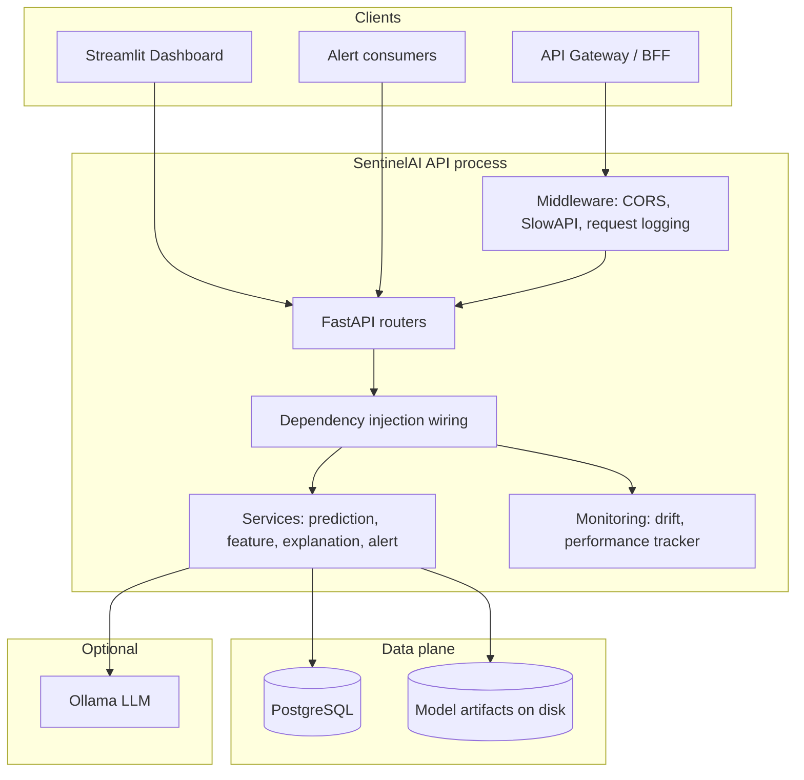
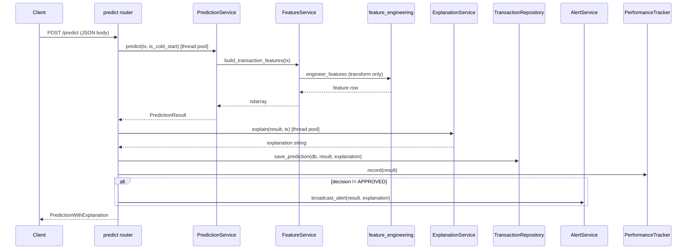

# SentinelAI

**SentinelAI** is a reference implementation of a real-time fraud scoring platform: a versioned **REST + WebSocket** service backed by **PostgreSQL**, **tree-based ML** (XGBoost) with **SHAP** explanations, an optional **Isolation Forest** cold-start path, **PSI drift** monitoring over persisted explanations, and **optional local Ollama** narratives. The design target is teams that need an auditable, self-hosted scoring tier without routing inference or PII through third-party LLM APIs.

This document describes **system architecture**, **operational boundaries**, and **extension points** suitable for technical due diligence, security review, or handoff to a platform engineering team.

---

## 1. Executive summary

| Dimension | Design choice |
|-----------|----------------|
| **Serving** | FastAPI (async I/O), Uvicorn; ML inference executed in a thread pool to avoid blocking the event loop. |
| **Persistence** | PostgreSQL; SQLAlchemy 2.x async sessions (`asyncpg`); audit trail per prediction. |
| **Explainability** | SHAP `TreeExplainer` on the supervised path; structured JSON stored for downstream drift analytics. |
| **Narrative layer** | Optional Ollama (`/api/chat`); deterministic SHAP-based fallback when LLM is unavailable. |
| **Real-time UX** | WebSocket channel for **BLOCKED** / **REVIEW** decisions with bounded in-memory history for reconnects. |
| **Schema lifecycle** | Either application-owned `create_all` or **Alembic**-managed migrations (`DATABASE_SCHEMA_MANAGED_BY`). |
| **Hardening** | API key auth (pluggable policy), SlowAPI rate limiting, structured JSON logging, correlation IDs, controlled error disclosure. |

---

## 2. System context

The service ingests a **transaction feature vector** (amount, time offset, PCA components V1–V28 as in the public ULB dataset contract). It emits a **fraud probability**, a **three-way decision** (APPROVED / REVIEW / BLOCKED) from configurable thresholds, optional **top-k SHAP contributions**, an optional **natural-language explanation**, and a **durable log row** for compliance and offline analytics.

Cold-start handling in this repository uses a **documented demo heuristic** (`app/utils/cold_start.py`) in the absence of a stable account or entity identifier in the public API schema. Production deployments should replace that policy with entity-centric velocity and tenure features wired through the same `PredictionService` interface.

---

## 3. High-level architecture

The system follows **strict layering**: transport adapters (HTTP/WebSocket) do not embed business rules; domain services encapsulate scoring, explanation, and alerting; the repository layer performs persistence only; configuration is centralized and typed.



---

## 4. Component catalog

| Layer | Path / module | Responsibility |
|-------|----------------|-----------------|
| **Entry** | `app/main.py` | ASGI app, lifespan (bootstrap), global exception handlers, middleware stack, router mounting. |
| **Configuration** | `app/config.py` | Pydantic Settings: thresholds, URLs, auth mode, pool sizing, logging flags, schema ownership. |
| **DI** | `app/dependencies.py` | Singleton wiring after startup; `Depends()` providers for services, DB session, settings. |
| **HTTP** | `app/routers/*.py` | Validation, orchestration, HTTP status mapping; **no** embedded scoring formulas. |
| **WebSocket** | `app/routers/websocket.py` | Alert subscription lifecycle; optional API key validation before `accept`. |
| **Scoring** | `app/services/prediction_service.py` | Feature matrix → XGBoost or Isolation Forest → decision → SHAP (supervised path only). |
| **Features** | `app/services/feature_service.py` + `ml/feature_engineering.py` | Single source of truth for column order and transforms. |
| **Explanations** | `app/services/explanation_service.py` | Ollama vs template fallback; LRU-cached by `(transaction_id, decision)`. |
| **Alerts** | `app/services/alert_service.py` | WebSocket fan-out, deque history, heartbeat broadcast. |
| **Persistence** | `app/db/transaction_repo.py` | CRUD-style access; rollback on failed commits. |
| **ORM** | `app/models/db_models.py` | `TransactionLog`, `ModelMetadata`. |
| **Contracts** | `app/models/schemas.py` | Pydantic v2 request/response models shared with OpenAPI. |
| **Drift** | `app/monitoring/drift_detector.py` | PSI over binned distributions; explicit baseline capture. |
| **KPIs** | `app/monitoring/performance_tracker.py` | In-process rolling window (per-instance). |
| **Auth module** | `app/modules/auth/` | API key verification (`AUTH_MODE`), WebSocket key probe. |
| **Rate limit** | `app/limiter.py` + `app/modules/rate_limit/keys.py` | SlowAPI limiter; key = hashed API key or client IP. |
| **Logging** | `app/modules/logging_config.py` | Plain text or JSON line format. |
| **Training** | `ml/train.py` | Offline fit; writes artifacts + `model_metadata.json` under `MODEL_DIR`. |
| **Dashboard** | `dashboard/app.py` | Streamlit operational UI against the REST API. |

---

## 5. Request lifecycle: synchronous scoring path

The following sequence applies to `POST /api/v1/predict` when models are loaded and the database is reachable. Inference and SHAP work run in **`asyncio.to_thread`** so concurrent HTTP requests are not serialized on the main event loop.



**Batch scoring** (`POST /api/v1/predict/batch`) follows the same logical steps per row, with aggregated counts and `skipped_duplicates` when `transaction_id` already exists in the audit log (HTTP **409** on single-row conflict; batch skips duplicates by design).

---

## 6. Data architecture

### 6.1 Primary audit entity: `transaction_logs`

Each scored transaction (when persistence succeeds) produces one row keyed by **`transaction_id`** (unique). Stored fields include fraud probability, decision, model identifier, cold-start flag, serialized SHAP list, optional explanation text, processing latency, and timestamp. Indexes support listing by **decision** and **time** for dashboards and drift sampling.

### 6.2 Model lineage: `model_metadata`

ORM table reserved for registered model versions (training metadata). Training script writes **`model_metadata.json`** alongside joblib artifacts; operators may sync that into the table as a separate integration step.

### 6.3 Schema ownership

| Mode | Behavior |
|------|----------|
| `DATABASE_SCHEMA_MANAGED_BY=app` | On startup, `init_db()` runs SQLAlchemy `metadata.create_all` against the async engine (convenience for dev). |
| `DATABASE_SCHEMA_MANAGED_BY=alembic` | `init_db()` is a no-op; **Alembic** (`alembic/`, `SYNC_DATABASE_URL`) is the source of truth. Docker entrypoint can run `alembic upgrade head` before Uvicorn. |

---

## 7. Machine learning subsystem

### 7.1 Train–serve contract

`ml/feature_engineering.py` defines **`FEATURE_COLUMNS`** and `engineer_features(...)`. Training (`ml/train.py`) fits the **StandardScaler** on amount/time stacks and persists the scaler with models. Serving (`FeatureService`) applies the same transform with **no refit**, and rejects engineered frames whose columns diverge from the trained list.

### 7.2 Models

- **XGBoost**: primary classifier; `predict_proba` drives fraud probability when not in cold-start mode.
- **Isolation Forest**: trained on non-fraud rows only; score-to-probability mapping uses configurable bounds (`ISO_SCORE_MIN` / `ISO_SCORE_MAX` in settings).
- **SHAP**: `TreeExplainer` attached lazily inside `PredictionService` for the XGBoost path only.

Artifacts expected under `MODEL_DIR` (filenames from `app/config.py`): `xgboost_fraud.pkl`, `isolation_forest.pkl`, `scaler.pkl`, `feature_names.json`. Missing files produce **`ModelNotFoundError`** at load time; the API remains up but scoring routes return **503** with an explicit JSON body.

---

## 8. Security and access control

| Mechanism | Implementation |
|-----------|----------------|
| **API keys** | `AUTH_MODE=none \| api_key`; when `api_key`, clients send `X-API-Key` or `Authorization: Bearer <key>`; keys supplied as comma-separated `API_KEYS`. Misconfiguration (auth on, no keys) returns **503** with a clear payload. |
| **Route coverage** | `predict` and `transactions` routers mount **`require_client_auth`** at router scope. **`GET /api/v1/metrics`** requires the same dependency (no-op when auth is off). Public: **`/health/*`**, **`/`**, OpenAPI (rate-limit exempt where configured). |
| **WebSockets** | Optional `api_key` query parameter or `x-api-key` header validated **before** `accept`. |
| **Error disclosure** | Generic **500** responses omit exception strings unless `EXPOSE_ERROR_DETAILS=true` or `APP_ENV=development`. |
| **CORS** | `CORS_ORIGINS`: comma-separated allowlist or `*` (discouraged in production; terminate TLS and restrict origins at the gateway). |

Defense in depth (mTLS, WAF, IP allowlists, secrets rotation) belongs at the **edge**; this service exposes hooks compatible with standard gateway patterns.

---

## 9. Operations and observability

### 9.1 Health endpoints

| Endpoint | HTTP | Purpose |
|----------|------|---------|
| `GET /api/v1/health/live` | 200 | **Liveness**: process accepts traffic; orchestrators should not restart on transient DB loss alone. |
| `GET /api/v1/health/ready` | 200 / **503** | **Readiness**: PostgreSQL connectivity **and** model artifacts ready for scoring. |
| `GET /api/v1/health` | 200 | Full JSON status (always 200 body; use **ready** for strict gate). |

### 9.2 Correlation

Successful responses attach **`X-Request-ID`** (echoed from client or generated). Error JSON includes **`request_id`** where applicable for log join.

### 9.3 Logging

`LOG_JSON=true` emits single-line JSON records suitable for centralized log platforms. `LOG_LEVEL` follows standard Python logging level names.

### 9.4 Rate limiting

**SlowAPI** applies process-local limits keyed by **hashed API key** when present, else **client IP** (`app/modules/rate_limit/keys.py`). `RATE_LIMIT_ENABLED` defaults off for frictionless development; enable in staging/production behind your gateway policy.

### 9.5 In-process metrics

`PerformanceTracker` maintains a bounded deque of recent decisions and latencies. This is **per replica** memory only; for fleet-wide SLO reporting, export metrics via your observability agent (Prometheus sidecar, OpenTelemetry collector, etc.).

---

## 10. Drift monitoring

`DriftDetector` implements **Population Stability Index (PSI)** over ten equal-width bins. Baseline distributions are set explicitly via **`POST /api/v1/transactions/drift/baseline`** using SHAP-impact aggregates sampled from recent `transaction_logs`. Until a baseline exists, drift responses indicate **`baseline_not_set`**. PSI thresholds align with module constants and settings (`DRIFT_PSI_THRESHOLD`, `DRIFT_CHECK_WINDOW`).

---

## 11. API surface (version 1)

Base path: **`/api/v1`**

| Method | Path | Auth if `AUTH_MODE=api_key` | Description |
|--------|------|-----------------------------|-------------|
| GET | `/health/live` | No | Liveness. |
| GET | `/health/ready` | No | Readiness (503 if not ready). |
| GET | `/health` | No | Combined status JSON (HTTP 200; gate on `/ready` for orchestrators). |
| GET | `/metrics` | Yes | Rolling performance metrics. |
| POST | `/predict` | Yes | Single transaction score. |
| POST | `/predict/batch` | Yes | Up to 100 transactions. |
| GET | `/predict/{transaction_id}` | Yes | Audit lookup. |
| GET | `/transactions` | Yes | Recent rows; `decision` query optional. |
| GET | `/transactions/metrics` | Yes | Same metrics object as `/metrics`. |
| GET | `/transactions/drift` | Yes | PSI drift report. |
| POST | `/transactions/drift/baseline` | Yes | Capture PSI baseline. |
| WS | `/ws/alerts` | Yes (`api_key` query or `x-api-key` header) | Live alert stream + heartbeat. |

OpenAPI schema: **`/openapi.json`**; interactive docs: **`/docs`**.

---

## 12. Configuration reference

All tunables live in **`app/config.py`** (environment-overridable via pydantic-settings). Highlights:

| Variable | Role |
|----------|------|
| `DATABASE_URL` | Async SQLAlchemy URL (`postgresql+asyncpg://…`). |
| `SYNC_DATABASE_URL` | Sync URL for Alembic / admin tooling (`postgresql://…`, requires `psycopg2-binary`). |
| `DATABASE_SCHEMA_MANAGED_BY` | `app` → `create_all`; `alembic` → migrations only. |
| `MODEL_DIR`, `*_MODEL_FILE`, `FEATURE_NAMES_FILE` | Artifact locations. |
| `FRAUD_THRESHOLD_BLOCK`, `FRAUD_THRESHOLD_REVIEW` | Decision boundaries. |
| `AUTH_MODE`, `API_KEYS` | Service-to-service authentication. |
| `RATE_LIMIT_ENABLED`, `API_RATE_LIMIT_PER_MINUTE` | SlowAPI behavior. |
| `APP_ENV`, `EXPOSE_ERROR_DETAILS` | Safe error payloads in production. |
| `CORS_ORIGINS` | Browser CORS policy. |
| `DB_POOL_SIZE`, `DB_MAX_OVERFLOW` | Connection pool sizing. |
| `OLLAMA_*`, `MAX_EXPLANATION_CACHE` | Optional LLM layer. |

Copy **`.env.example`** to `.env` and override for each environment.

---

## 13. Deployment

### 13.1 Local development

```bash
python -m venv .venv
source .venv/bin/activate   # Linux / macOS
pip install -r requirements.txt
cp .env.example .env
uvicorn app.main:app --reload --host 127.0.0.1 --port 8000
```

Train models (dataset path: `ml/data/creditcard.csv`):

```bash
python ml/train.py
```

### 13.2 Container stack

- **`Dockerfile`**: Python 3.11 slim, installs dependencies, entrypoint script.
- **`docker-compose.yml`**: PostgreSQL with healthcheck; API service with volume-mounted `app/models/ml` and environment wired for Alembic-first schema.
- **`scripts/docker-entrypoint.sh`**: Runs **`alembic upgrade head`** when `DATABASE_SCHEMA_MANAGED_BY=alembic`, then execs the process supervisor command.

### 13.3 Continuous integration

`.github/workflows/ci.yml` runs **Ruff** and **pytest** on push/PR. Extend with container image build, SBOM, or contract tests as your release policy requires.

---

## 14. Operational dashboard

```bash
streamlit run dashboard/app.py
```

Headless bind (for CI or background capture):

```bash
streamlit run dashboard/app.py --server.port 8501 --server.address 127.0.0.1 --server.headless true
```

Then open **`http://127.0.0.1:8501`** in a browser. With the FastAPI service and Postgres up, metrics and charts populate from the live API; without them, the UI still renders and shows explicit empty states (useful for layout / portfolio shots).

Environment:

- `SENTINEL_API_BASE` — default `http://127.0.0.1:8000/api/v1`
- `SENTINEL_API_KEY` — when the API runs with `AUTH_MODE=api_key`

**Upwork / marketing assets** live under **`docs/screenshots/`**:

| File | What it is |
|------|------------|
| **`upwork-thumbnail.png`** | **1200×630** v2 — high-contrast catalog hero (default for listings). |
| **`upwork-thumbnail-v1.png`** | **1200×630** v1 — classic gradient + stat tiles (reproducible from script). |
| **`upwork-dashboard.png`** | Full-page Streamlit ops dashboard (charts + audit trail). |
| **`next-console-dashboard.png`** | Next.js `/dashboard` (when capture script finds a dev server). |

**Elite preview (no Docker)** — regenerates the dashboard PNG with curated demo telemetry + hidden Streamlit chrome:

```bash
python scripts/capture_elite_dashboard_png.py
python scripts/capture_upwork_thumbnail.py
```

**Recommended (one command)** — waits for API health, seeds live `/predict` traffic, starts Streamlit headlessly, captures **1920×** PNGs:

```bash
docker compose up -d --build   # Postgres + API (+ optional console)
pip install -r requirements.txt
python -m playwright install chromium
python scripts/capture_portfolio_assets.py --with-docker --wait-ready 600
```

For a manual flow, use **`scripts/capture_dashboard_screenshot.py`** with **`--seed-first`**, or run **`python scripts/seed_demo_traffic.py`** once before opening Streamlit. Optional `--out` on the legacy capture script; portfolio script writes fixed paths under `docs/screenshots/`.

### 14.1 Next.js catalog console (portfolio / Upwork)

The **`frontend/`** app is a production-style ops console: **`/dashboard`** (KPIs, decision mix, WebSocket incident stream, scoring sandbox with SHAP), **`/lookup`**, **`/model-health`**. It ships Open Graph metadata and a **`docker compose`** service so the full stack can run together.

**Local dev (best for screen recordings):** bring up API + Postgres, then:

```bash
cd frontend
cp .env.example .env.local   # adjust NEXT_PUBLIC_API_BASE / API_KEY if needed
npm install
npm run dev:catalog
```

Open **`http://localhost:3010`** (port **3010** avoids common conflicts with other tools on **3000**).

**Docker (API + DB + console):** from the repo root:

```bash
docker compose up -d --build
```

| Service | URL |
|---------|-----|
| OpenAPI / docs | `http://localhost:8000/docs` |
| Next.js console | `http://localhost:3010` |

The browser calls the API at **`http://localhost:8000`**; keep that port published. For a public catalog link, set **`NEXT_PUBLIC_SITE_URL`** in `.env.local` (or build args) so social previews resolve.

---

## 15. Horizontal scaling and known limitations

| Topic | Current behavior | Enterprise extension |
|-------|------------------|------------------------|
| **Alert WebSockets** | In-memory subscriber list per process | Sticky sessions, or replace with Redis pub/sub / Kafka for fan-out across replicas. |
| **Performance tracker** | In-memory deque per process | Push counters to Prometheus / cloud metrics; treat in-process numbers as best-effort per pod. |
| **Rate limiting** | Per-process SlowAPI | Edge rate limit (API gateway) + optional Redis token bucket for global fairness. |
| **Ollama** | Synchronous HTTP from worker threads | Dedicated sidecar, queue-based explanation service, circuit breaker. |

These boundaries are intentional: they keep the core repository small, testable, and easy to reason about while remaining compatible with standard Kubernetes deployment patterns.

---

## 16. Quality gates

```bash
ruff check app ml tests
ruff format app ml tests
pytest -q
```

**Integration tests** use `TestClient` as a **context manager** so the ASGI **lifespan** runs (singleton services wire correctly). Validation-only cases stub `require_prediction_service` so `422` responses can be asserted without local model artifacts or PostgreSQL.

**Offline evaluation** (after training and with `creditcard.csv` present):

```bash
python ml/evaluate.py
```

---

## 17. Dataset

Training uses the public **[ULB Credit Card Fraud Detection](https://www.kaggle.com/datasets/mlg-ulb/creditcardfraud)** dataset (not committed). Place `creditcard.csv` under `ml/data/` before running `ml/train.py`.

---

## 18. License

Add a `LICENSE` file (e.g. MIT, Apache-2.0) when distributing beyond private portfolio use. Until then, treat the repository as **reference / private** unless you explicitly open-source it.
